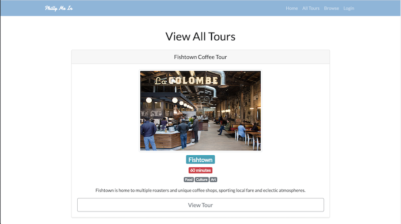

# Philly Me In

 "Philly Me In" is a full-stack web application that allows users to leverage their knowledge of the City of Brotherly Love -- or the knowledge of others -- to create and explore custom walking tours of Philadelphia. Viewing and browsing tours does not require the creation of an account, but registered users have the ability to create, describe, tag, and share their tours so that other users can view them. Handy browse features make it easy to view tours categorized by a particular neighborhood or tag. 

 To get started, visit https://philly-me-in.herokuapp.com/. 

 

 

 ## Who is this for?

- Philadelphians with an interest in sharing their local knowledge.
- Local business owners interested in spurring interest in their area.
- Neighborhood associations who want to showcase the highlights of their neighborhood for tourists and locals.
- Tourists who want to share “insider” info for other tourists to make use of.

# Develop

Clone the repository and then install the dependencies.

```
git clone <this repo>
cd /<this repo>
npm install
```
Once the packages have been installed, you will need to stand up a local MySQL database either via the command line or in your preferred MySQL workbench. Make sure that you've created a `.env` file in the root of your directory; add your local MySQL password to it.

```
LOCAL_MYSQL_PASSWORD=YOURPASSWORDHERE
```

Then, create the database in workbench.

```
CREATE DATABASE PhillyMeIn
```
Running the program for this first time will create the necessary tables based on the models defined in Sequelize. The database will be empty, but the necessary infrastructure will be in place to add content via your browswer or your preferred MySQL workbench.

```
node server.js
```
That's it! Happy coding.


# Technologies Used

- Node.js
- Express
- Sequelize (ORM for database modeling and queries)
- Express Handlebars (templating)
- Passport.js (authentication)
- JavaScript
- jQuery
- MySQL
- HTML/CSS
- Bootstrap
- Heroku (for deployment)
- ESLint + Travis

# Future Improvements

For future improvements, check out the issues tab.

# Dev Team

- Jen Pirrone: https://github.com/jpirrone104
- Kenny Whitebloom: https://github.com/calemonte
- Jason Horowitz: https://github.com/jhorowitz96
- Nathan Daly: https://github.com/dalynat